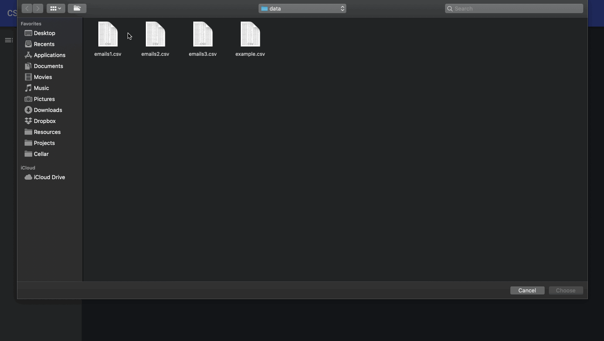

csv_viewer
==========

Dependencies
------------

If using `asdf` version manager, install the following by issuing `asdf install`
at the project root:

- Python 3
- Node.js
- PostgreSQL (use `pg_ctl start` to start)
- Redis (use `redis-server` to start)

Setup
-----

Issue `bin/setup` from the project root to set up dependencies. This script
assumes the minimal requirements above are installed and running and will:

1. Create and activate a virtualenv at the project root
2. Install Python dependencies
3. Create a `.env` file to set development-mode config variables
4. Create and migrate the database
5. Install npm dependencies
6. Build assets
7. Start the development server at http://127.0.0.1:8000

To revert changes, issue `bin/setup --down`.

Demo
-----

Work in Progress
----------------

- Deployment
- Automated testing
- Smarter cookie parsing
- Multiple file upload handling
